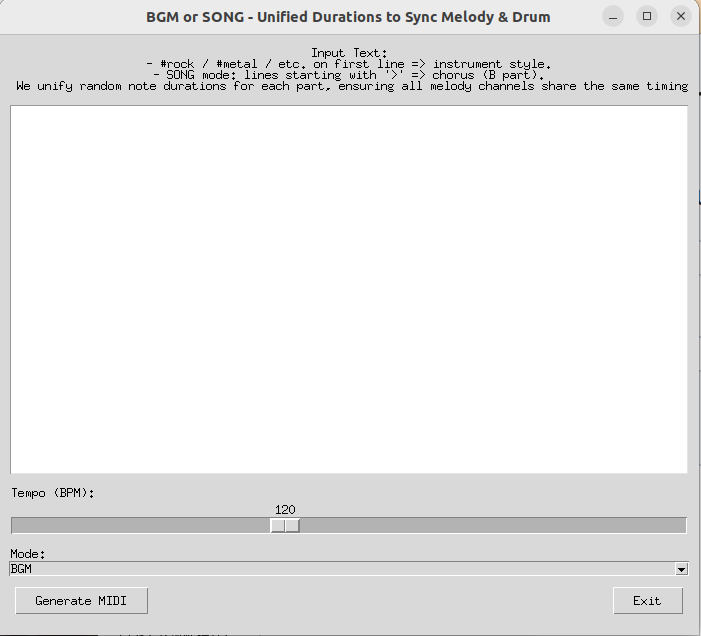

# randomsound
- Random sound creator

# How to use
1. describe your words, sentences.
2. select tempo (music speed) adjust
3. select music mode
4. Press Generate MIDI
5. random music is created by your sentence image

# Screen Image



## command line
```
python random_music.py

```

# Requirement 

```
mido
numpy

```
# Reference

https://mido.readthedocs.io/en/stable/
